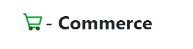

    

### This e-commerce solution will provide you the single vendor/multi-vendor application with admin panel where a vendor can do all necessary tasks in this. The tech stack has been used is MERN (MongoDB, Express, React(Next.js), Node.js). This app has been built on REST API with JWT authentication. The features have been listed as below

### **For Users**

-   Login
-   Registration
-   Account activation with email
-   User details update
-   Send password reset link in email
-   Password reset
-   Product Section:
    -   Add product to cart
    -   Remove product from cart
    -   Update product of cart
    -   Add product review
    -   Update product review
    -   Get products by ID
    -   Get products by search
    -   Get filtered products
    -   Payment Gateway API integration
    -   On payment done email the invoice to the user
    -   Ask for refund of the purchased product
    -   Track the product delivery status
    -   Chat with the vendor directly from user account without third-party library

### **For Vendors**

-   Vendor registration
-   Vendor login
-   Vendor details update
-   Send password reset link in email
-   Password reset
-   Category insert
-   Category update
-   Category delete
-   Product insert
-   Product update
-   Product delete
-   Get user reviews
-   Get all users
